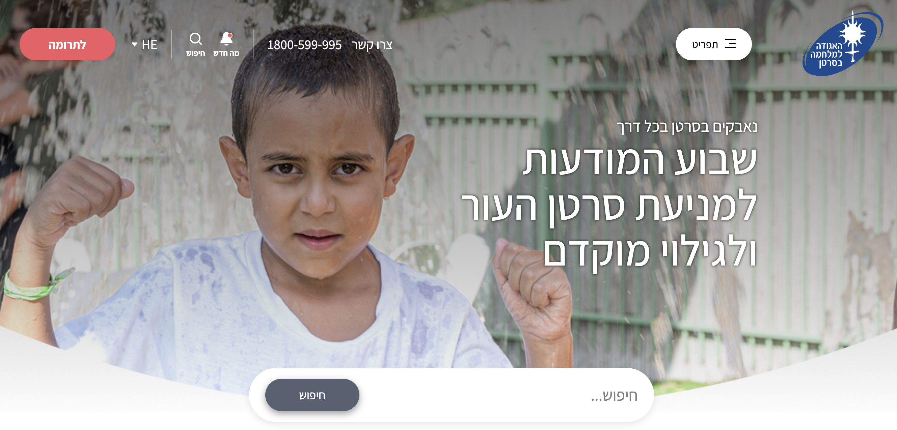

# Landing page

## Demo

[Demo](https://alexanderkulemin.github.io/test-landpage/)

## Setup

Download or clone repo.\
\
Run `npm install` in the project root folder to install dependencies

## Available Scripts

In the project directory, you can run:

### `npm run start`

Runs the app in the development mode.\
Open [http://localhost:3000](http://localhost:3000) to view it in your browser.

### `npm run build`

Builds the app for production to the `build` folder.

## Technologies

## Project features

- BEM methodology
- Gulp
- SASS
- Nunjucks
